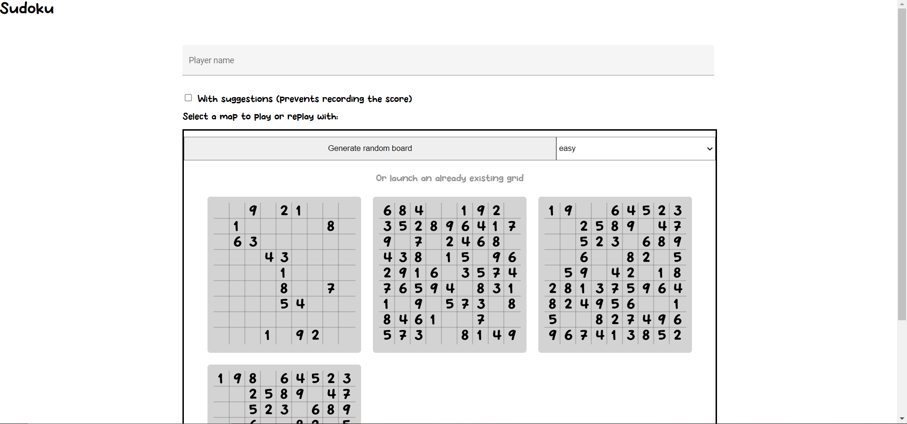
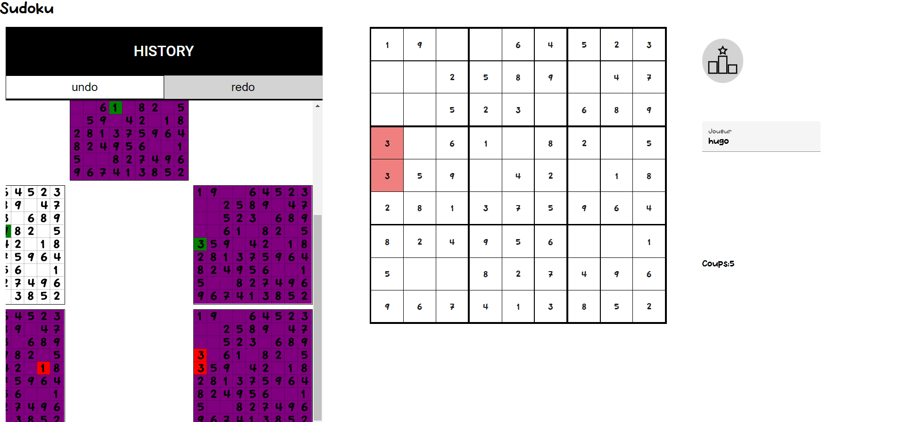
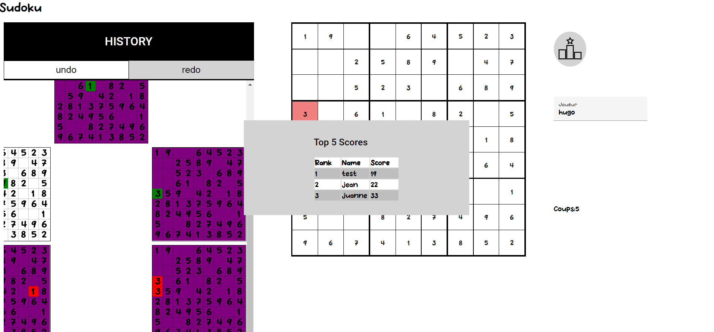

# CPOO2 Project - Selim Gmati, Hugo Lamoureux

This is a copy from my gitlab repository

## Project's description
Sudoku game. A player can generate and play a random new grid or play an already existant grid. He can see his score and the topScores. He can also undo and redo his moves thanks to the history board.


## Visuals
Home screen :
###
 

###
Board screen :
###
 

###
High Scores :
###
 

## Installation and Usage

Clone this repo, and then launch the back-end : You have to run the MainApp class in game/game-backend/src/main/java/MainApp.java

You can then run the front-end. Open the game/game-frontend/ in a terminal and run the following commands :
```
npm i
npm start
```

## Technologies used

For the Back-End, we've used Spring Boot. For the Front-End, we've used Angular with Interacto to handle undoable actions.
